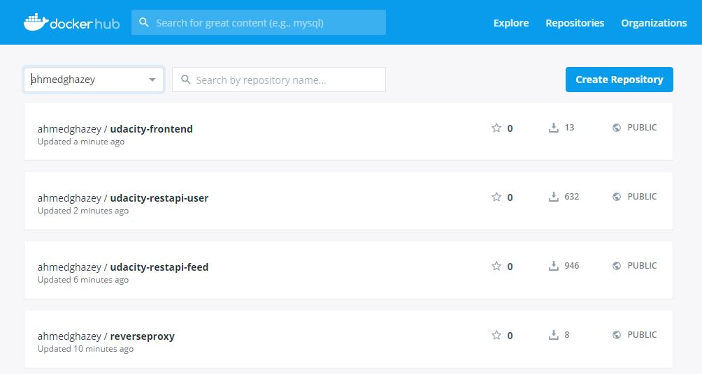
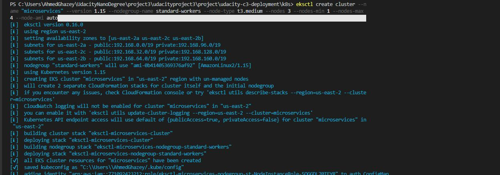

# Cloud developer nanodegree
## Project3

### Setting Environment Variables 
I'm Windows User Adding variables 
1-RightClick MyComputer
2-Select Properties 
3-EnvironmentVariables
4- Add New etc..
5- repeat 4 until finish them
## Steps


### Build images: 
```
docker-compose -f docker-compose-build.yaml build --parallel` 
```

 

### check images
Docker images:
```
docker images
``` 

  


### Docker Compose Up:
```
docker compose up
``` 

 


### push the images 
```
dcoker-compose -f docker-compose-build.yaml push
```   

  


### Docker Hub:




### Create Cluster
```
eksctl create cluster --name "microservices" --version 1.15 --nodegroup-name standard-workers --node-type t3.medium --nodes 3 --nodes-min 1 --nodes-max 4 --node-ami auto
```
 

### Updating Kubernetes Resources

Encrypt username, password and aws credentials file:

```
cat ~/.aws/credentials | base64
```

```
echo POSTGRESS_USERNAME | base64
```

```
echo POSTGRESS_PASSWORD | base644
```

 Update files `env-secret.yaml`, `aws-secret.yaml`, and `env-configmap.yaml` with the right values.
 
 
```
kubectl apply -f aws-secret.yaml
``` 

```
kubectl apply -f env-secret.yaml
``` 

```
kubectl apply -f env-configmap.yaml
```


Apply all files:
```
kubectl apply -f .
```


### Pods Status

```
kubectl get all
```

 


### Services Port Forwarding

```
kubectl port-forward service/frontend 8100:8100 
```
```
kubectl port-forward service/reverseproxy 8080:8080 
```
 

